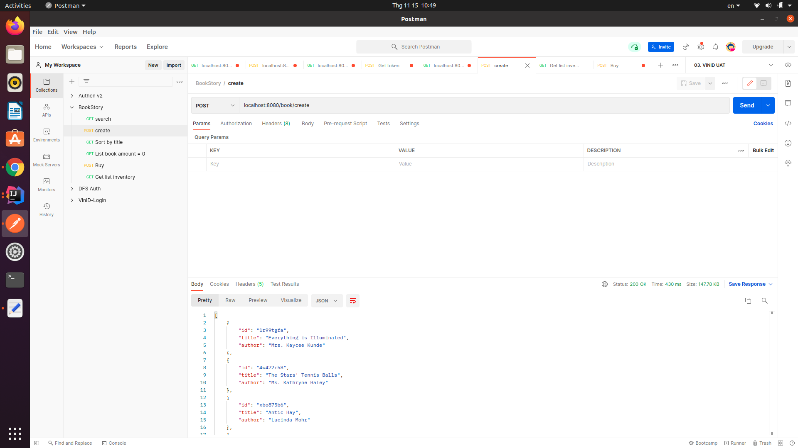
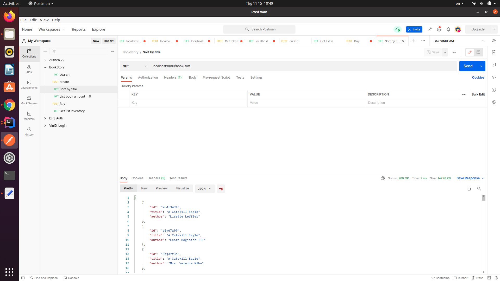
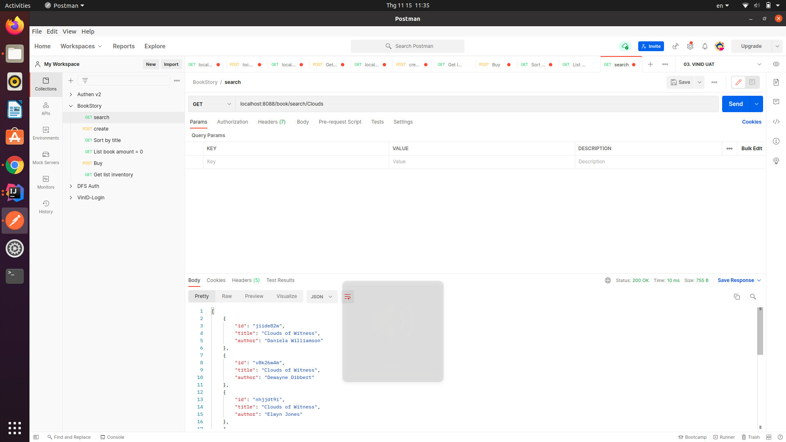
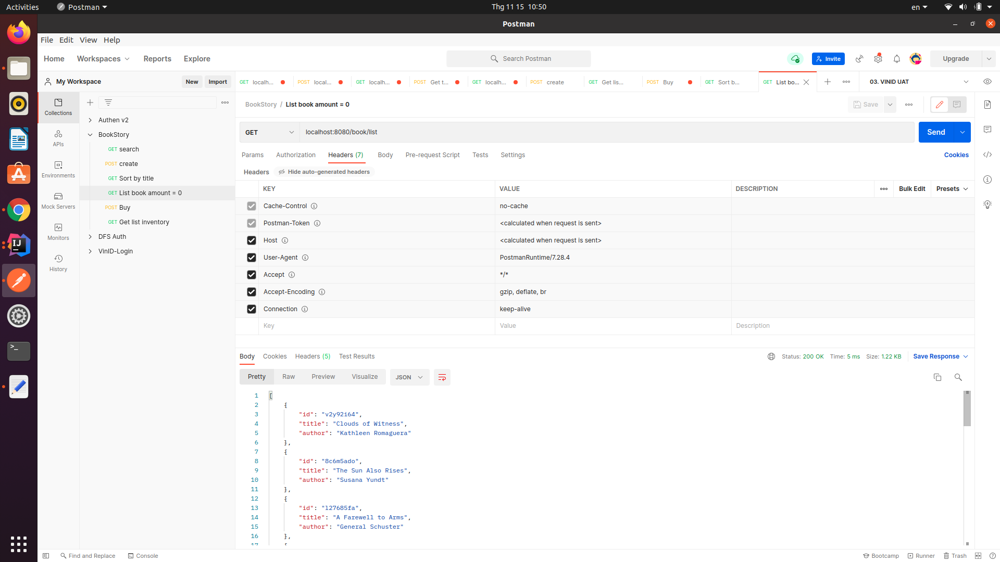
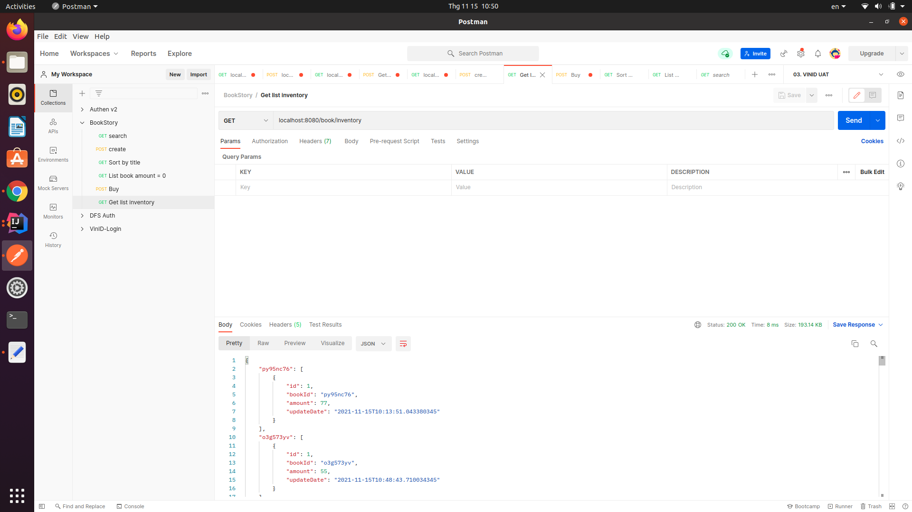
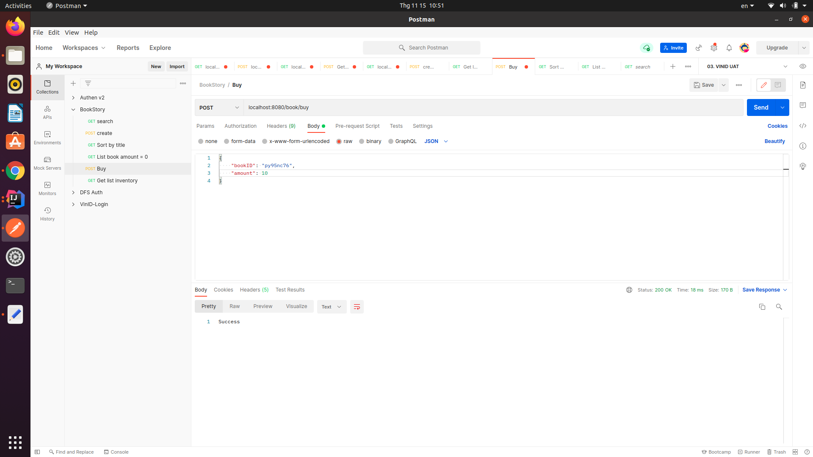
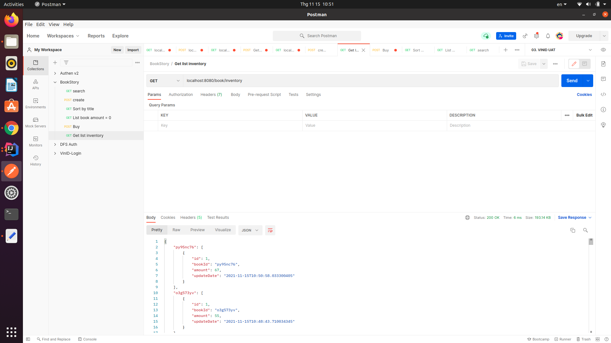
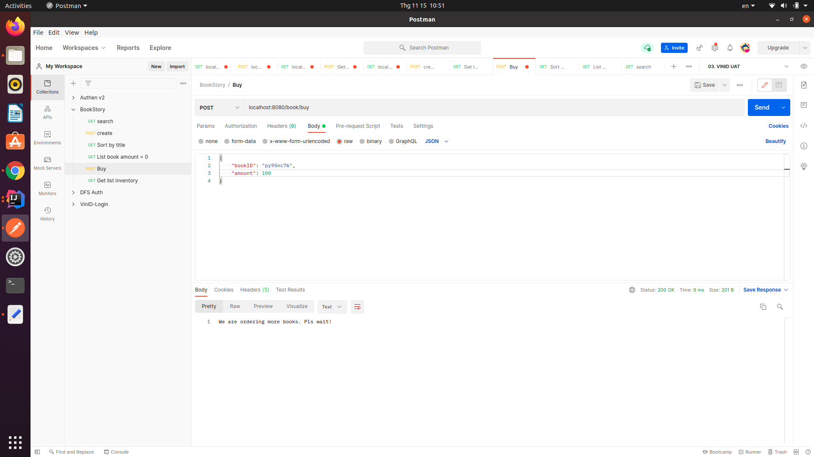

# BookManagement
1. Create fake data for 1000 books

    url: localhost:8088/book/create
2. Sort list by title

    url: localhost:8088/book/sort
3. Search book by title (keyword)

    url: localhost:8088/book/search/{subtitle}
4. Get list book that has amount = 0

    url: localhost:8088/book/list
5. Buy book

    request: bookId (required), amount

    url: localhost:8088/book/buy

    With valid bookId:
    - example:

    bookId: "py95nc76" - amount: 77

When the number of Books user want to buy smaller than the amount of Books in the inventory then "Success".

the amount of book in the inventory will change by "amount - quantity" and updated date change by the buying time.

Otherwise, send a message to user waiting for ordering new books

And call the event to order more books.

    